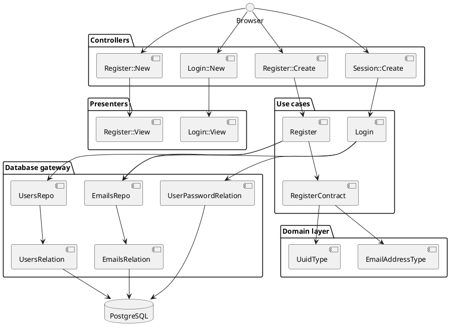

# Architecture Overview

## Clean Architecture

The application follows [Clean Architecture](https://blog.cleancoder.com/uncle-bob/2012/08/13/the-clean-architecture.html) principles:

- **Presenters** are ERB views that handle rendering
- **Gateways** are Hanami/ROM repositories and relations for data access
- **Controllers** are Hanami actions that handle HTTP requests
- **Use cases** are Hanami operations encapsulating business logic

## Component Diagrams

The diagram shows the application's component structure organized by Clean Architecture layers.
Each layer delegates inward toward the domain layer.
For detailed component documentation, see:
- [Controllers](../components/controllers.md)
- [Presenters](../components/views.md)
- [Use cases](../components/business-logic.md)
- [Database gateway](../components/database.md)
