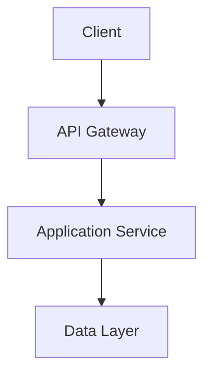

# Architecture Overview

## Clean Architecture

The application follows [Clean Architecture](https://blog.cleancoder.com/uncle-bob/2012/08/13/the-clean-architecture.html) principles:

- **Presenters** are ERB views that handle rendering
- **Gateways** are Hanami/ROM repositories and relations for data access
- **Controllers** are Hanami actions that handle HTTP requests
- **Use cases** are Hanami operations encapsulating business logic

## Component Diagrams

[Add component diagrams and explanations here]
