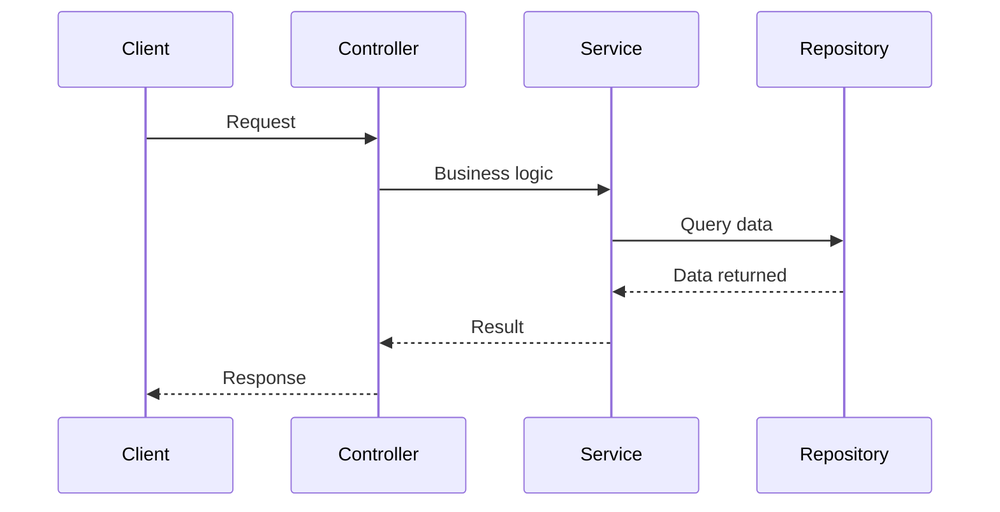

# Class Interactions

## Overview

[Describe how classes collaborate to fulfill use cases]

### Sequence Diagrams

```mermaid
sequenceDiagram
    participant Client
    participant Controller
    participant Service
    participant Repository
    
    Client->>Controller: Request
    Controller->>Service: Business logic
    Service->>Repository: Query data
    Repository-->>Service: Data returned
    Service-->>Controller: Result
    Controller-->>Client: Response
```

[Add detailed sequence diagrams for complex interactions]
